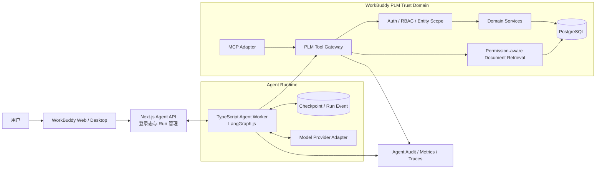

# ADR-0001：PLM 企业研发智能体总体架构

| 属性 | 内容 |
|---|---|
| 日期 | 2026-08-12 |
| 状态 | **Accepted** |
| 决策者 | 项目负责人 |
| 影响范围 | WorkBuddy Pro、Agent Runtime、PLM Tool、知识检索、审计与评测 |
| 关联文档 | [产品需求](./AGENT_PRODUCT_REQUIREMENTS.md) · [PLM Tool Contract v1](./PLM_TOOL_CONTRACT_V1.md) · [Action Agent ADR](./ADR-ACTION-AGENT.md) |

> 本决策于 2026-08-12 获项目负责人确认。实施状态与验证证据以 [实施计划](./AGENT_IMPLEMENTATION_PLAN.md) 为准；后续若改变运行时、信任边界或写操作模型，应以新 ADR 替代本决策。

## 1. Context

WorkBuddy Pro 已有项目/任务、BOM、技术参数、ECR/ECO、知识库和项目级 RBAC，但尚没有企业 Agent 运行时、稳定 Tool 层、组织数据、Agent 审计或评测体系。现有生产门禁也尚未全部关闭，因此智能体必须增量建设，不能把模型直接接入数据库或扩大现有安全边界。

本决策需要同时满足：

- WorkBuddy Pro 继续是唯一业务事实源；
- 权限在确定性服务端执行，而不是交给提示词或模型判断；
- 首期单 Agent、只读、可审计，后续才开放受控动作；
- 结构化业务查询与非结构化文档检索分流；
- 运行可中断、可恢复、可观测、可评测；
- 模型供应商和 Agent SDK 可替换，PLM Tool Contract 保持稳定；
- 尽量复用当前 TypeScript/Next.js/Prisma/PostgreSQL 技术栈，控制新增运维复杂度。

## 2. Decision

采用 **“WorkBuddy Pro 事实源 + 独立 TypeScript Agent Worker + LangGraph.js 编排 + PLM Tool Gateway + 可选 MCP Adapter”** 的总体架构。

### 2.1 核心决策

1. **事实源不变**：项目、任务、BOM、ECR/ECO、文档、用户和权限只由 WorkBuddy Pro 业务服务与 PostgreSQL 管理。
2. **Agent 不直连业务数据库**：Agent Worker 只能调用 allowlist 中的 PLM Tool；Tool 内复用或封装现有 domain service，并执行当前用户鉴权。
3. **独立运行时**：Agent Worker 与 Next.js Web 逻辑隔离，可独立限流、熔断、扩缩容和停用；MVP 可与 Web 部署在同一内网，但保持进程与接口边界。
4. **LangGraph.js 作为主要 Harness**：用显式状态图承载 Tool 循环、检查点、超时、重试、人工确认和恢复；首期只实现一个业务 Agent。
5. **协议与实现解耦**：以 Zod/JSON Schema 定义单一 Tool Contract，同时生成 Worker 调用适配和 MCP Tool 描述。MCP Adapter 在核心 Tool 稳定后启用，不复制业务逻辑。
6. **混合数据路径**：结构化业务事实走 Tool；工程文档走权限过滤后的关键词/混合检索。向量索引不是结构化主数据副本，也不是授权源。
7. **服务端委托身份**：浏览器只向 WorkBuddy 发起 Agent Run。WorkBuddy 依据登录态创建短期、服务端签名的执行上下文；Tool Gateway 每次调用重新读取账号状态、角色和项目/实体权限。
8. **证据优先**：Tool 返回 `data + evidence + asOf + scope + warnings`。Agent 的数字和关键结论只能引用 Tool 证据。
9. **双层审计**：业务 `AuditLog` 记录业务状态变化；独立 Agent 审计记录 Run、模型、提示版本、Tool 参数摘要、结果摘要、证据、耗时和错误。第三方观测平台不能替代合规审计。
10. **写入后置**：v1 Tool 全部 `sideEffect = none`。后续动作遵循提议、版本重验、人工确认、幂等执行、回读验证和双重审计。
11. **运行时基线校准**：Node 20 已于 2026-04-30 EOL，不再作为新 Worker 的生产基线。项目声明 Node `>=22 <27`，锁定 `@langchain/langgraph 1.4.9`、`@langchain/core 1.2.5`，并在 Node 22.22.2 与 24.12.0 实测 Runtime/Tool 故障集。

### 2.2 逻辑架构

### 2.3 组件职责

| 组件 | 职责 | 明确不负责 |
|---|---|---|
| WorkBuddy UI / Agent API | 登录、创建/取消 Run、项目上下文、SSE 事件、证据跳转、确认页 | 不执行模型生成的 SQL，不自行判定实体权限 |
| Agent Worker | 意图编排、Tool 选择、状态图、检查点、回答合成、步数/时间限制 | 不拥有业务事实，不直连业务表，不执行最终审批 |
| Model Provider Adapter | 屏蔽模型供应商差异、能力探测、流式输出、用量记录 | 不承载 PLM 权限和 Tool 业务规则 |
| PLM Tool Gateway | Tool 注册、Schema 校验、委托身份验证、RBAC、超时、结果裁剪、审计 | 不让模型调用任意内部函数或原始 SQL |
| Domain Services | 复用当前项目/任务/BOM/变更/知识库业务规则和事务 | 不感知自然语言提示 |
| Document Retrieval | 权限前置过滤、版本/片段检索、引用定位、提示注入隔离 | 不替代文档主表和权限系统 |
| MCP Adapter | 将已注册 Tool 映射为 MCP，供经批准的内部客户端使用 | 不另写查询、不绕过 Gateway、不扩大权限 |
| Agent Audit/Observability | Run/Tool 追踪、指标、错误、评测关联、成本统计 | 不保存令牌、密码和无必要的完整敏感正文 |

### 2.4 一次只读请求的执行序列

1. 用户通过 WorkBuddy 登录态提交问题；Web 层创建 `AgentRun` 和 `traceId`。
2. Web 层向 Worker 发送服务器生成的短期委托上下文，模型不可见也不可修改其中的身份字段。
3. Worker 解析意图；若项目名称歧义，调用解析 Tool 并只展示有权限候选。
4. Worker 调用 PLM Tool Gateway；Gateway 重新验证用户状态、权限和实体归属。
5. Tool 通过 domain service 获取结构化结果，附证据、数据时间、计算口径和裁剪说明。
6. Worker 在最大步数和超时内组合回答；数字必须来自 Tool 结构化字段。
7. UI 流式展示结论、引用和限制；Run 与 Tool 审计落库。取消只终止该 Run，不影响 PLM 主业务。

### 2.5 状态、队列与恢复

- MVP 使用 PostgreSQL 保存 `AgentRun`、检查点和事件，不为首版额外引入 Redis 或 Temporal。
- 每个 Run 有有限状态：`QUEUED → RUNNING → WAITING_FOR_USER → SUCCEEDED/FAILED/CANCELLED/EXPIRED`。
- Worker 使用租约/心跳避免同一 Run 被并发执行；恢复时从最后成功检查点继续。
- 每个 Run 设置最大执行时长、最大模型轮次、最大 Tool 次数和最大结果字节数；具体阈值在性能试验后写入配置。
- 当出现真正跨小时/跨系统、有 SLA 的业务编排时，再评估 Temporal；不为简单问答提前引入。

### 2.6 身份与信任边界

- Tool input schema 中没有 `userId`、`role`、`visibleProjectIds` 或 `permissionCodes`。
- 委托上下文只在受信服务之间传递，包含 `runId/traceId/sessionId/issuedAt/expiresAt`；Tool Gateway 根据 session/subject 重新查询当前用户。
- Agent 使用的服务身份只能调用 Tool Gateway，不能获得数据库凭据或管理员万能令牌。
- 模型、文档片段、用户文本和 Tool 文本输出均属于不可信输入；只有服务器配置和签名执行上下文属于控制面。
- 非可见实体在 Agent 边界统一返回 `resource_not_accessible`，不暴露实体是否存在。

### 2.7 文档检索边界

- 阶段 5 使用 PostgreSQL 内的确定性 Markdown 分块与关键词检索建立基线，不引入 embedding、向量库或第二业务事实源。
- 片段记录文档版本、标题路径、内容哈希、索引版本和提示注入标记；只保留每个文档最新版。固定 10 条关键词知识集的阶段门槛为 Recall@5 ≥ 0.90、引用支持率 100%；完整不少于 50 条的跨场景评测仍属于阶段 8。
- 权限在召回前按当前 `Documents.projectId` 过滤，并在 Tool Gateway 逐次重验项目成员关系；片段表的 `projectId` 仅为 ACL 快照，不能作为最终授权依据。`projectId = null` 明确为公共文档，仍要求登录身份和 `kb:read`。
- 文档业务事务写入 Outbox；独立索引器使用抢占、过期租约恢复和文档级 advisory lock 幂等替换片段。索引延迟只在调用方可见范围内作为 `warnings` 暴露。
- 只有文档规模、延迟或更具代表性的召回评测证明关键词基线不足时，才评审 pg_trgm/全文/向量混合检索；不得用框架能力替代评测证据。

### 2.8 可观测与评测

- 产品数据库保存最小、可审计的 Run/Tool/Approval/Feedback 记录。
- 可选自托管 Langfuse 用于 trace、prompt 和实验观察；启用前评审许可证、数据保留与敏感信息脱敏。
- Promptfoo 或等价测试 Harness 用于离线正确性、Tool 选择、提示注入和越权红队，并接入 CI。
- 模型、系统提示、Tool schema 和数据夹具均带版本，评测结果能关联到具体组合。

## 3. Alternatives Considered

| 方案 | 优点 | 代价/风险 | 结论 |
|---|---|---|---|
| A. 直接在 Next.js 内使用 OpenAI Agents SDK | PoC 快；TypeScript；官方 Tool/MCP/Tracing 能力；组件少 | Web 请求与 Agent 生命周期耦合；持久恢复、隔离和多供应商策略需自行补强；SDK/Node 版本需与受支持的 Node LTS 基线核验 | 作为快速原型或 Model Adapter 备选，不作为当前主架构 |
| **B. 独立 TS Worker + LangGraph.js** | 显式状态图、检查点、HITL 和恢复适合企业流程；复用 TS 技术栈；与 Web/模型解耦 | 新增 Worker、状态持久化和运维面；团队需掌握图式编排 | **推荐** |
| C. Microsoft Agent Framework（Python/.NET） | 工作流、检查点、HITL、可观测能力完整；适合 Azure/.NET 体系 | 引入第二语言/运行时；与当前 TS 服务的共享类型和部署成本更高 | 若公司确定 Azure/.NET 为战略平台再评估 |
| D. Dify/RAGFlow 作为核心运行平台 | 可视化搭建快；RAG 管理能力丰富 | 核心权限/业务事务仍需自研；平台升级、许可证和数据边界增加治理成本；容易形成双重事实源 | 仅用于隔离 PoC 或文档检索组件评估，不承载 PLM 核心 |
| E. 自研无限循环 Agent | 表面依赖少、自由度高 | 检查点、HITL、重试、审计、评测和安全边界都需重造，失控风险高 | 不采用 |

主要候选的上游参考：

- [LangGraph.js](https://github.com/langchain-ai/langgraphjs)
- [OpenAI Agents SDK for JavaScript](https://github.com/openai/openai-agents-js)
- [Microsoft Agent Framework](https://github.com/microsoft/agent-framework)
- [Dify](https://github.com/langgenius/dify)
- [RAGFlow](https://github.com/infiniflow/ragflow)
- [Langfuse](https://github.com/langfuse/langfuse)
- [Promptfoo](https://github.com/promptfoo/promptfoo)

实施前必须锁定具体版本、核对运行时要求、许可证和漏洞；ADR 只决定职责与主要方向，不等于批准任意最新依赖进入生产。

## 4. Consequences

### 4.1 Positive

- 权限、业务规则和事实仍集中在 WorkBuddy，减少模型绕过控制面的可能。
- Tool Contract 与 Agent Harness 解耦，将来更换模型或 SDK 不需要重写 PLM 能力。
- 独立 Worker 可以单独限流、暂停、扩缩容和故障隔离，不拖垮主 Web 服务。
- 显式状态和检查点为后续人工确认、长流程恢复和幂等执行提供基础。
- 结构化数据与文档检索分流，既保持数字确定性，也支持工程知识问答。
- 单 Agent 起步便于建立评测集和失败分类，避免过早引入多 Agent 的成本与不可预测性。

### 4.2 Negative

- 需要新增 Worker 部署、内部鉴权、Run/Tool 审计表和运行监控。
- 现有 domain service 返回结构并非稳定公共契约，需要增加适配层和分页/证据字段。
- 组织、负载、活动和文档证据数据必须先治理，不能只靠提示词补齐。
- PostgreSQL 同时承担业务、Run 和检查点时需做连接池、索引、保留期和容量隔离。
- MCP 与内部 Tool 适配若没有单一 Schema 源，容易产生双份契约，因此实现必须禁止复制逻辑。

### 4.3 Risks and Mitigations

| 风险 | 缓解措施 |
|---|---|
| Agent Worker 持有过大权限 | 仅持有 Tool Gateway 服务权限；用户权限每次重验；无数据库凭据 |
| 提示注入诱导越权或写入 | 系统级 Tool allowlist；文档视为数据；v1 无写 Tool；越权/注入评测 |
| 模型循环和成本失控 | 最大步数、Tool 次数、token、时间和并发配额；取消与熔断 |
| 状态恢复导致重复执行 | 检查点、Run 租约、操作幂等键；写阶段执行前版本重验 |
| 观测平台泄露敏感数据 | 默认脱敏和摘要；自有审计为准；保留策略与部署方式单独审批 |
| 索引权限滞后 | ACL 前置过滤 + 返回前二次鉴权；Outbox 增量更新；延迟告警 |
| 框架锁定 | Tool 和业务服务不依赖 LangGraph 类型；状态模型和事件格式由项目定义 |
| 当前生产基线未完成验收 | Agent 部署门禁继承并收紧现有生产验收，不以 Agent PoC 代替主系统验收 |

## 5. Implementation Guardrails

- 所有 Tool schema 由同一 TypeScript/Zod 源生成 JSON Schema、内部类型和 MCP 描述。
- Agent Worker 代码不得导入 `@/lib/prisma`，CI 增加静态约束。
- Tool Gateway 只注册显式 allowlist，拒绝任意函数名、任意 URL 和原始查询表达式。
- 所有列表查询有稳定排序、默认 limit、最大 limit、可选 cursor 和查询超时。
- 数字回答禁止从自然语言片段二次计算；必要计算放入确定性 Tool 并返回算法版本。
- 任何第三方 trace 都不是业务审计的唯一副本。
- Action Agent 已由 [ADR-0002](./ADR-ACTION-AGENT.md) 单独约束动作分级、确认 UI、并发控制、幂等和回滚；总体 Worker 仍不得直接写业务库。

## 6. Validation Criteria

该 ADR 只有在以下架构验证通过后才能从“提案”进入“接受并已验证”：

- Agent Worker 无数据库连接串，且静态/运行时均不能直接访问 Prisma。
- 非项目成员、停用用户和降权用户的 Tool 调用按预期拒绝。
- 同一 Tool 可通过内部适配和 MCP Adapter 运行，并得到相同结构化结果与权限范围。
- Worker 异常、模型超时、用户取消不会影响 WorkBuddy 主业务请求。
- Run 在 Worker 重启后可从检查点恢复，且不会重复产生业务副作用。
- 每个数字能关联 Tool 字段和证据；无数据、歧义、权限拒绝均有确定性行为。
- 模型供应商替换实验不要求修改 Tool Gateway 或 domain service。

## 7. Accepted Decisions

- [x] 使用独立 TypeScript Agent Worker，不把完整 Agent 循环放入 Next.js 请求生命周期。
- [x] LangGraph.js 是首选 Harness；已锁定 1.4.9/Core 1.2.5，并因 Node 20 EOL 把生产基线校准为 Node 22–26。
- [x] Agent 不直连 PostgreSQL，只通过 PLM Tool Gateway 访问业务能力。
- [x] 内部 Tool 与 MCP 共用单一 Schema 和权限实现；MCP 在 Tool v1 稳定后启用。
- [x] PostgreSQL 承载 MVP Run/Checkpoint，暂不引入 Redis/Temporal。
- [x] 模型供应商通过 Provider Adapter 和环境配置选择；数据驻留、脱敏与保留要求在上线阶段验证。
- [x] 公共文档首版保持当前已登录可见语义；组织数据采用主部门模型并叠加组织/项目权限。
- [x] 若运行时、信任边界或写入协议发生核心变化，以新 ADR supersede 本文档。
